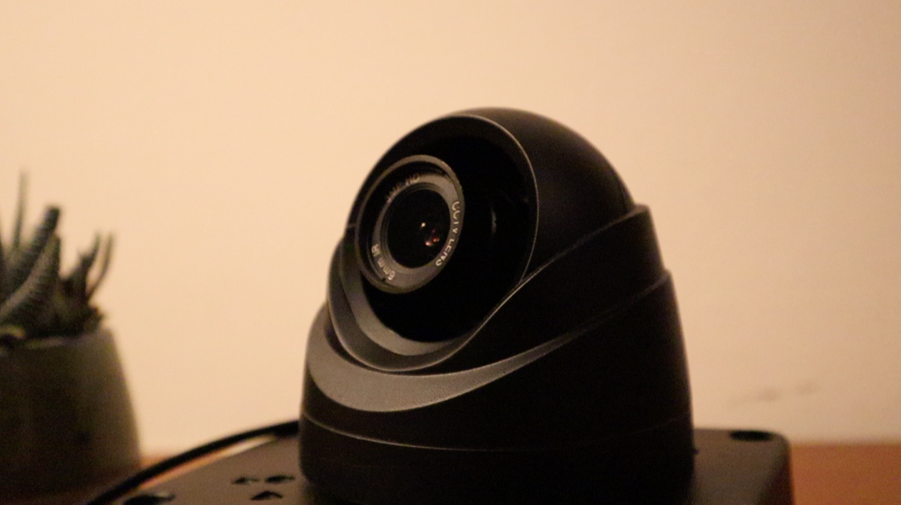
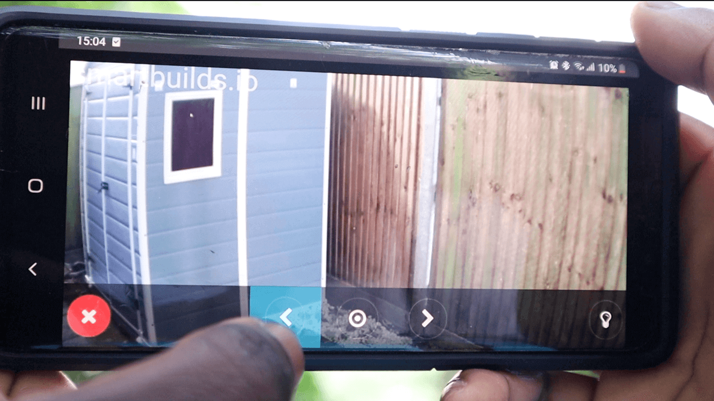
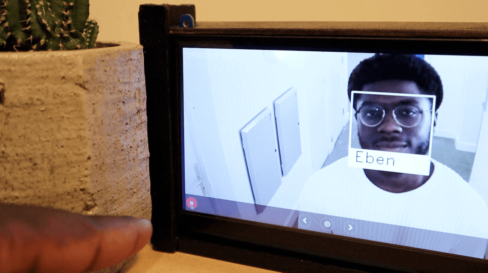
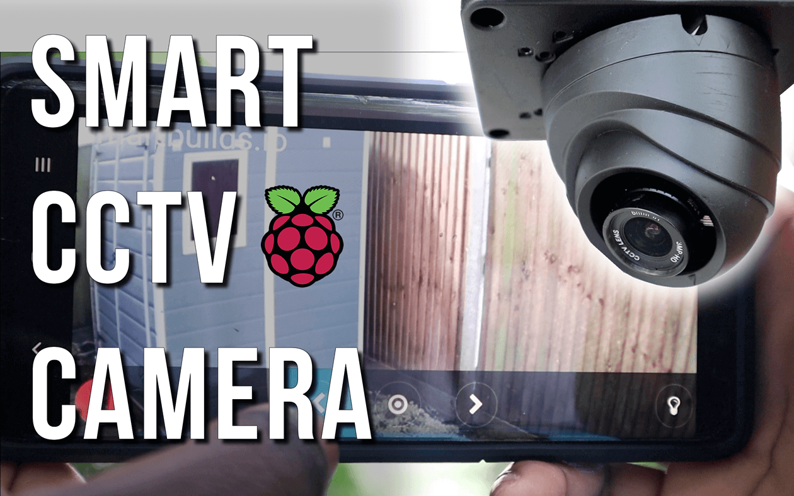

# SmartCCTV Camera - Build with a Raspberry Pi

Build your own home Raspberry Pi powered surveillance iOT camera with Face recognition, access your live feed for any device. project by [SmartBuilds.io](http:smartbuilds.io)

## How it works
The Camera would be able to be accessed from any device on the network, and you'll be notified when a known/unknown person is at your door
by Email. With the a touchscreen interactive you would be able to also rotate your camera to view the blindspots you've wondered about.
This is fully customisable You can add features from IR LED for night vision to Sound module for audio output. 

## Screenshots
|  |  |  | 
|---|---|---|
| Smart CCTV | Live Pi Camera Stream | Face Recognition | 


## Preconditions

* Minimum Raspberry Pi 4, 2GB is recommended for optimal Face recognition performance
* [OpenCV face-recognition](https://github.com/ageitgey/face_recognition)
* Raspberry Pi 4 Camera Module or Pi HQ Camera Module (Newer version)
* Python 3 recommended.


## Step 1 – Install dLib Library & Face recognition Library
You can find more details on the updated Pi 4 compatible installation notes on [Smartbuilds.io](https://smartbuilds.io/installing-face-recognition-library-on-raspberry-pi-4/):


## Step 2 – Cloning SmartCCTV
Open up terminal and clone the SmartCCTV repo:

```
bash cd /home/pi
git clone https://github.com/EbenKouao/SmartCCTV-Camera
```

## Step 3 – Launch Web Stream
**Pre-requisite:** Ageitgey Face_recognition Library is installed:

Note: Creating an Autostart of the main.py script is recommended to keep the stream running on bootup.
```bash cd modules
sudo python3 /home/pi/SmartCCTV-Camera/main.py
```
You could test a successful installation by running the Python script: facerec_from_webcam_faster.py
From here you could program to add multiple profiles. We encourage contribution to this project.

## Download Beta image of SmartCCTV-camera
Any troubles installing, try out the already compiled Raspberry Pi (Raspbian OS) Image of [SmartCCTV Camera](https://smartbuilds.io).

